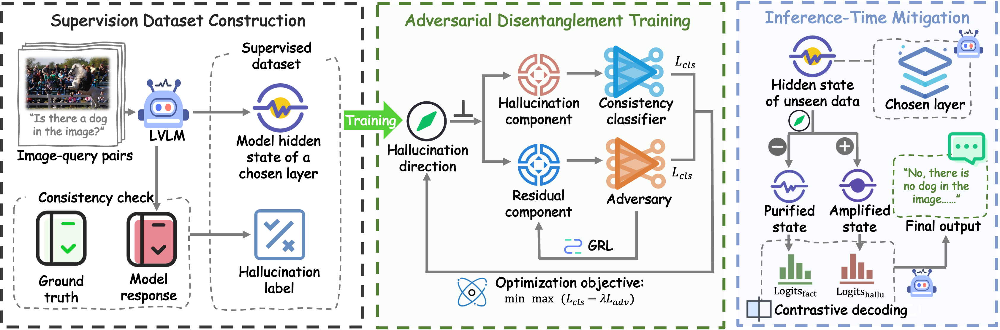

# AOD: Adversarial Orthogonal Disentanglement for LVLM Hallucination Mitigation
隐隐约约隐隐约约隐隐约约隐隐约约隐隐约约隐隐约约隐隐约约隐隐约约隐隐约约隐隐约约隐隐约约隐隐约约隐隐约约隐隐约约隐隐约约隐隐约约隐隐约约隐隐约约隐隐约约隐隐约约隐隐约约隐隐约约隐隐约约隐隐约约隐隐约约有，；梦你，n n n n n n n n n n n n n n n n n n n n n n n n n n n n n n n n n n n n n n n n n n n n n n n n n n n n n n n n n n n n n n n n n n n n n n n n n n n n n n n n n n n n n n n n n n n n n n n n n n n n n
Official implementation of **Adversarial Orthogonal Disentanglement (AOD)**, a
training-free, dual-forward-pass contrastive decoding strategy that mitigates
hallucination in Large Vision-Language Models via latent geometric
decomposition.

> AOD learns a *single* hallucination direction with a minimax adversarial
> objective: a consistency classifier concentrates hallucination signals into
> the projection, while a Gradient Reversal Layer (GRL) adversary purges them
> from the orthogonal residual. At inference, the same direction enables
> contrastive decoding without any extra training.

<p align="center">
  
</p>

<p align="center"><sub>
  Figure: AOD framework. Hidden states are extracted from a chosen layer and
  decomposed into a projected hallucination component and an orthogonal
  residual; a minimax objective concentrates hallucination into the projection
  and purges it from the residual; at inference, dual-forward-pass contrastive
  decoding penalises hallucinatory logits.
  (From the paper, Figure 2.)
</sub></p>

---

## Highlights

- **Three backbones, one pipeline.** LLaVA-1.5-7B, Qwen2.5-VL-7B, and
  InternVL3-8B share the same extract → train → eval pipeline. Swap with a
  single `--model_id` flag.
- **Eight paper benchmarks, end-to-end.** POPE, HallusionBench, AMBER, CHAIR
  (hallucination); OCRBench-v2, RealWorldQA, MMStar, MMMU (utility).
- **Single learned direction.** Hallucination benchmarks use an in-domain
  trained direction; utility benchmarks zero-shot reuse the POPE-trained
  direction, per the paper protocol.
- **Two intervention modes.**
  - `direct`: subtract the hallucination component from layer-`L` hidden state.
  - `cd`: dual-forward contrastive decoding with Adaptive Plausibility
    Constraint (APC) — the default reported in the paper.

## Repository Layout

```text
AOD/
├── assets/                  # Figures used in this README
├── cli/                     # Thin Python entry points (used by scripts/)
├── scripts/                 # 4 dispatcher shell scripts (see Quick Start)
│   ├── extract.sh
│   ├── train.sh
│   ├── eval.sh
│   └── inspect.sh
└── src/aod/
    ├── core/                # Backbone-agnostic AOD math + training
    │   ├── aod.py           #   AODDisentangler, GRL, train/save/load
    │   └── dataset.py       #   LayerDataset for extracted hidden states
    ├── data/                # Benchmark loaders + metrics
    │   ├── amber.py         #   AMBER discriminative loader
    │   └── chair.py         #   CHAIR_S / CHAIR_I scoring
    ├── vlm/                 # Touches the LVLM
    │   ├── loader.py        #   load_vlm, prompt builders, Yes/No token ids
    │   ├── intervention.py  #   AODDecodeConfig, aod_next_token_logits,
    │   │                    #   greedy_generate_ids, layer steering hook
    │   └── config.py        #   AutoConfig inspector
    └── pipelines/           # CLI implementations (one main() per benchmark)
        ├── extract_pope.py
        ├── extract_hallusionbench.py
        ├── extract_amber.py
        ├── train_layers.py
        ├── eval_layers.py
        ├── eval_binary.py
        ├── eval_multichoice.py
        └── eval_generative.py
```

## Installation

```bash
python -m venv .venv
source .venv/bin/activate
pip install -r requirements.txt
```

Set `HF_HOME` if model weights are cached outside the default location.

## Expected Data Layout

```text
data/
  POPE/{coco_pope_popular,coco_pope_random,coco_pope_adversarial}.json
  POPE/val2014/
  hallusion_bench/HallusionBench.json
  hallusion_bench/hallusion_bench/
  AMBER/data/{query/query_all.json, annotations.json}
  AMBER/image/
  coco/annotations/{captions_val2014.json, instances_val2014.json}
  coco/val2014/
  OCRBench_v2/{ocrbench_v2.jsonl, images/}
  RealWorldQA/{test.jsonl, images/}
  MMStar/{test.jsonl, images/}
  MMMU/{validation.jsonl, images/}
```

`data/` and `output/` are git-ignored.

> POPE distribution files end in `.json` but are actually JSON Lines (one
> object per line) — the extractor uses a line-by-line iterator.

## Quick Start

All operations route through four dispatcher scripts. Each takes the model
alias and (where relevant) the benchmark as positional arguments; extra flags
pass through to the underlying CLI.

| Phase     | Command                                                                              |
|-----------|--------------------------------------------------------------------------------------|
| Extract   | `bash scripts/extract.sh <model> <benchmark> [extra args]`                           |
| Train     | `bash scripts/train.sh   <layers_dir>          [extra args]`                         |
| Evaluate  | `bash scripts/eval.sh    <model> <benchmark>   [extra args]`                         |
| Inspect   | `bash scripts/inspect.sh <model>`                                                    |

Model aliases: `qwen2_5vl`, `llava`, `internvl3` (or pass any HF repo id
directly via `--model_id`).

### 1. Extract hidden states

```bash
bash scripts/extract.sh qwen2_5vl pope            --layers 24
bash scripts/extract.sh llava     hallusionbench  --layers 24
bash scripts/extract.sh internvl3 amber           --layers 24
```

`--layers 24` matches the paper's reported intervention layer. Use a wider
sweep (e.g. `--layers 1-31`) to reproduce the layer-ablation in Figure 7a.

### 2. Train the AOD direction

```bash
bash scripts/train.sh output/layers/qwen2_5vl_pope --layers 24
```

Defaults follow the paper appendix: seed `42`, 5 epochs, batch `256`, AdamW
`1e-3`, probe hidden `512`, `--grl_lambda 1.0` for the adversary.

The training target is factual consistency:

```text
y = 1 if base_prediction == ground_truth else 0
```

The classifier supervises the projected AOD component; the GRL adversary
operates on the orthogonal residual.

### 3. Diagnose the learned direction

```bash
bash scripts/eval.sh qwen2_5vl layers \
  --ckpt      output/aod_ckpt/qwen2_5vl_pope/aod_pope_layer_24.pt \
  --layers_dir output/layers/qwen2_5vl_pope
```

This is a hidden-state-only check (classifier accuracy on the projection,
adversary suppression on the residual) — it does not run model generation.

### 4. Evaluate

**Hallucination benchmarks** (in-domain trained direction):

```bash
bash scripts/eval.sh qwen2_5vl pope            --mode cd --ckpt output/aod_ckpt/qwen2_5vl_pope/aod_pope_layer_24.pt
bash scripts/eval.sh llava     hallusionbench  --mode cd --ckpt output/aod_ckpt/llava_hallusionbench/aod_hallusionbench_layer_24.pt
bash scripts/eval.sh internvl3 amber           --mode cd --ckpt output/aod_ckpt/internvl3_amber/aod_amber_layer_24.pt
bash scripts/eval.sh qwen2_5vl chair           --mode cd --ckpt output/aod_ckpt/qwen2_5vl_pope/aod_pope_layer_24.pt
```

**Utility benchmarks** (POPE-trained direction, zero-shot transfer):

```bash
bash scripts/eval.sh qwen2_5vl mmmu        --mode cd --ckpt output/aod_ckpt/qwen2_5vl_pope/aod_pope_layer_24.pt
bash scripts/eval.sh llava     mmstar      --mode cd --ckpt output/aod_ckpt/llava_pope/aod_pope_layer_24.pt
bash scripts/eval.sh internvl3 realworldqa --mode cd --ckpt output/aod_ckpt/internvl3_pope/aod_pope_layer_24.pt
bash scripts/eval.sh qwen2_5vl ocrbench    --mode cd --ckpt output/aod_ckpt/qwen2_5vl_pope/aod_pope_layer_24.pt
```

Mode flag: `--mode {base|direct|cd}`. Common hyperparameters:
`--aod_alpha 1.0 --beta 0.5 --apc_alpha 0.1`. For CHAIR, the metric is
computed in-process when `--coco_instances_path` is set (the dispatcher does
this by default).

## Coverage Matrix

| Benchmark        | Stage           | Qwen2.5-VL-7B | LLaVA-1.5-7B | InternVL3-8B |
|------------------|-----------------|:-------------:|:------------:|:------------:|
| POPE             | extract + Y/N   | ✅            | ✅           | ✅           |
| HallusionBench   | extract + Y/N   | ✅            | ✅           | ✅           |
| AMBER (discr.)   | extract + Y/N   | ✅            | ✅           | ✅           |
| CHAIR (COCO)     | gen + score     | ✅            | ✅           | ✅           |
| OCRBench-v2      | gen (dump)      | ✅            | ✅           | ✅           |
| RealWorldQA      | multi-choice    | ✅            | ✅           | ✅           |
| MMStar           | multi-choice    | ✅            | ✅           | ✅           |
| MMMU             | multi-choice    | ✅            | ✅           | ✅           |

AOD direction training is backbone-agnostic; it operates on the hidden states
emitted by the extract phase.

## Direct CLI Access

The dispatchers are thin wrappers around `cli/*.py`. Calling them directly
makes the full argument surface explicit:

```bash
python cli/eval_vlm_aod_binary.py \
  --model_id qwen2_5_vl \
  --dataset_format amber \
  --data_path data/AMBER/data/query/query_all.json \
  --amber_annotations_path data/AMBER/data/annotations.json \
  --image_root data/AMBER/image \
  --mode cd \
  --ckpt output/aod_ckpt/qwen2_5vl_amber/aod_amber_layer_24.pt \
  --aod_alpha 1.0 --beta 0.5 --apc_alpha 0.1
```

Every `cli/*.py` is a sys-path shim around an `aod.pipelines.*` module —
`python -m aod.pipelines.eval_binary --help` also works once `src/` is on
`PYTHONPATH`.

## Notes on Reproduction

- **Intervention layer.** Layer `24` is used for all three backbones, matching
  Figure 7a in the paper.
- **In-domain split.** Hallucination benchmarks use an 80/20 in-domain split
  during extract/train; the same split is honoured by `pipelines/train_layers.py`.
- **Zero-shot transfer.** The four utility benchmarks reuse the POPE-trained
  direction with no further training.
- **Decoding hyperparameters.** Defaults (`alpha=1.0`, `beta=0.5`,
  `apc_alpha=0.1`) match the paper's main-table configuration.

## Citation

If you use this code or method, please cite the paper.
